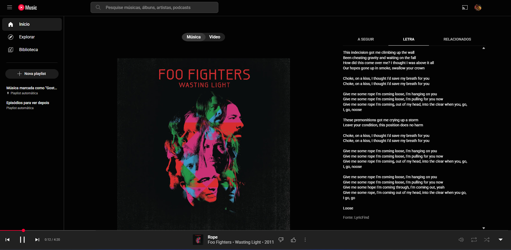
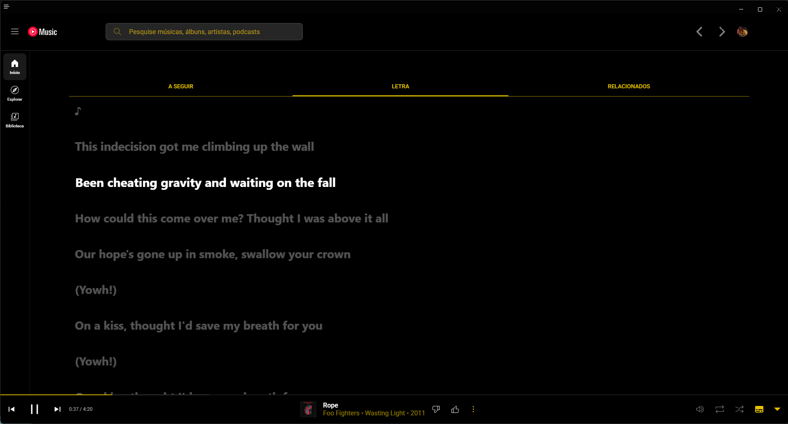
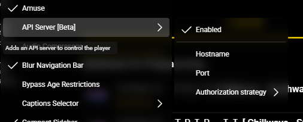
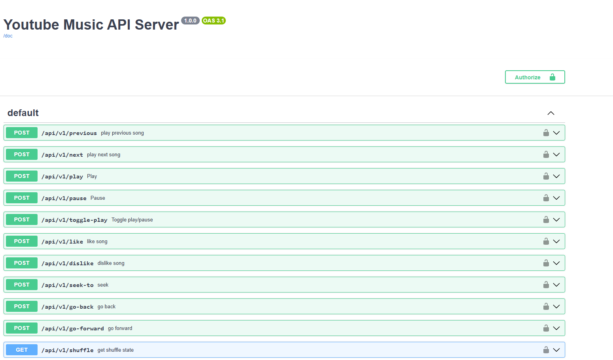

### Context of the project

I really liked to turn off all the lights, and just listen to the music. I always listen but doing something apart. I listen today with no distractions, just the song.

<video src="../../assets/lyrics-at-real-time-at-my-phone/chilling.mp4" width="300" controls></video>

But also, I wanted to see the lyrics to get the meaning of the song. The problem is, the integration of Official Youtube Music is a complete garbage at PC compared to Spotify. For example:

1. Hotkeys buttons (Next song, Back song, Pause) doesn't work;
2. There's no communication with the Youtube Music Phone and the Desktop. If i'm chilling in my chair, I don't want to move my spine to skip a ~~fucking~~ song. And also, all my lights are off. I need to move and to figure out which key was <kbd>FN</kbd> and which key was<kbd>F9</kbd>.
3. The lyrics and just plenting lyrics, without animmation to show in which verse the singer are. Take a look:


_Offical Youtube Music_


_Non-official Youtube Music_

Big difference, right?

But, I want to use my phone to show the lyrics, who is way better than show in my monitor, because of the OLED. When I see **black** in my monitor, is not black black, is like a darkness gray, but not truly black, otherwise, my phone is black black. BLACK.

So, if I show the lyrics in my phone synced to Youtube Music?

### The project

The main goal of this project is show the lyrics of the song in my phone, showing in real time the verse of the lyric synced with the singer.

First things first, with the custom Youtube Music, we have avaliable a bunch of plugins to change the aspects of the official Youtube Music. One of them is API Server, who whem enabled, will provide a API.


We can acess by `localhost:26538/swagger` and see all the endpoints avaliable.



Unfortunally, no one provides something related to lyrics.

I opened the Custom Youtube Music Dev Tools, to see which endpoint they are calling to get the lyrics, and I found an endpoint from [LRCLIP](https://lrclib.net/), a Open Source service too find and contribute to sync lyrics (How amazing is this?).

The CustomYM uses [this search function](https://github.com/th-ch/youtube-music/blob/315fa15eeca453370e8fcb1ecf9dbab9f87d87aa/src/plugins/synced-lyrics/providers/LRCLib.ts#L12-L78) to find the song and return the lyrics.

The lyrics are not provide by a socket, is a endpoint who return the timestamp and the verse of the song.

```json
[
  {
    "id": 19614657,
    "name": "Time (You and I)",
    "trackName": "Time (You and I)",
    "artistName": "Khruangbin",
    "albumName": "Mordechai",
    "duration": 356.0192,
    "instrumental": false,
    "plainLyrics": "That's life\nIf we had more time\nWe could live forever [...]",
    "syncedLyrics": "[00:17.40] That's life\n[00:18.50] If we had more time [...]"
  }
]
```

So, probably the code of the CustomYM knows how to handle with this, syncing the timestamp of the song with the response timestamp. But our first goal is just export this information to the API who CustomYM provides.
